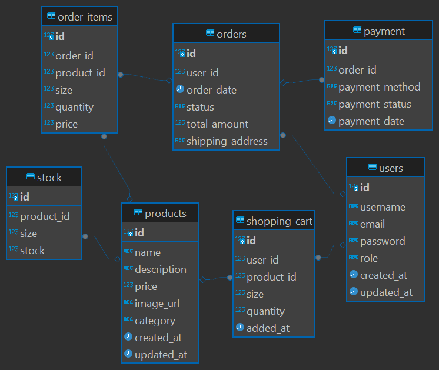

# Jejak Gaya

Website toko sepatu ini dirancang dengan frontend menggunakan React dan backend menggunakan Node.js. Fitur utama meliputi halaman admin dan customer untuk mengelola dan membeli sepatu.

Jejak gaya adalah platform e-commerce yang khusus menjual sepatu merk Nike. Kami menyediakan berbagai koleksi sepatu Nike terbaru dan paling populer untuk memenuhi kebutuhan fashion dan olahraga Anda. Baik Anda seorang penggemar sepatu atau seorang atlet profesional, kami memiliki sesuatu untuk Anda.

## Fitur

- Daftar akun user
- Memasukkan produk kedalam keranjang user
- Dashboard admin
- Melihat jumlah keseluruhan dari produk dan pesanan pelanggan
- CRUD data produk
- CRUD data ukuran
- CRUD data stok produk
- tambah akun admin

## ERD

## Tech Stack

- Frontend : React.js dan Tailwind CSS
- Backend : Express.js dan Node.js
- DB : PostgreSQL
- Devops : Version control (Git & Github)

## query

-- Membuat Tabel Users
CREATE TABLE Users (
    id SERIAL PRIMARY KEY,
    username VARCHAR(255) NOT NULL,
    email VARCHAR(255) UNIQUE NOT NULL,
    password VARCHAR(255) NOT NULL,
    role VARCHAR(50) CHECK (role IN ('customer', 'admin')) DEFAULT 'customer',
    created_at TIMESTAMP DEFAULT CURRENT_TIMESTAMP,
    updated_at TIMESTAMP DEFAULT CURRENT_TIMESTAMP
);

-- Membuat Tabel Products
CREATE TABLE Products (
    id SERIAL PRIMARY KEY,
    name VARCHAR(255) NOT NULL,
    description TEXT,
    price DECIMAL(10, 2) NOT NULL,
    image_url VARCHAR(255),
    category VARCHAR(255),
    created_at TIMESTAMP DEFAULT CURRENT_TIMESTAMP,
    updated_at TIMESTAMP DEFAULT CURRENT_TIMESTAMP
);

-- Membuat Tabel Stock
CREATE TABLE Stock (
    id SERIAL PRIMARY KEY,
    product_id INT REFERENCES Products(id) ON DELETE CASCADE,
    size INT NOT NULL,
    stock INT NOT NULL DEFAULT 0
);

-- Membuat Tabel Orders
CREATE TABLE Orders (
    id SERIAL PRIMARY KEY,
    user_id INT REFERENCES Users(id) ON DELETE SET NULL,
    order_date TIMESTAMP DEFAULT CURRENT_TIMESTAMP,
    status VARCHAR(50) CHECK (status IN ('pending', 'shipped', 'delivered', 'canceled')) DEFAULT 'pending',
    total_amount DECIMAL(10, 2) NOT NULL,
    shipping_address VARCHAR(255) NOT NULL
);

-- Membuat Tabel Order_Items
CREATE TABLE Order_Items (
    id SERIAL PRIMARY KEY,
    order_id INT REFERENCES Orders(id) ON DELETE CASCADE,
    product_id INT REFERENCES Products(id) ON DELETE SET NULL,
    size INT NOT NULL,
    quantity INT NOT NULL,
    price DECIMAL(10, 2) NOT NULL
);

-- Membuat Tabel Shopping_Cart
CREATE TABLE Shopping_Cart (
    id SERIAL PRIMARY KEY,
    user_id INT REFERENCES Users(id) ON DELETE CASCADE,
    product_id INT REFERENCES Products(id) ON DELETE CASCADE,
    size INT NOT NULL,
    quantity INT NOT NULL,
    added_at TIMESTAMP DEFAULT CURRENT_TIMESTAMP
);

-- Membuat Tabel Payment
CREATE TABLE Payment (
    id SERIAL PRIMARY KEY,
    order_id INT REFERENCES Orders(id) ON DELETE CASCADE,
    payment_method VARCHAR(50) CHECK (payment_method IN ('credit_card', 'bank_transfer', 'paypal')) NOT NULL,
    payment_status VARCHAR(50) CHECK (payment_status IN ('paid', 'unpaid', 'failed')) DEFAULT 'unpaid',
    payment_date TIMESTAMP DEFAULT CURRENT_TIMESTAMP
);

